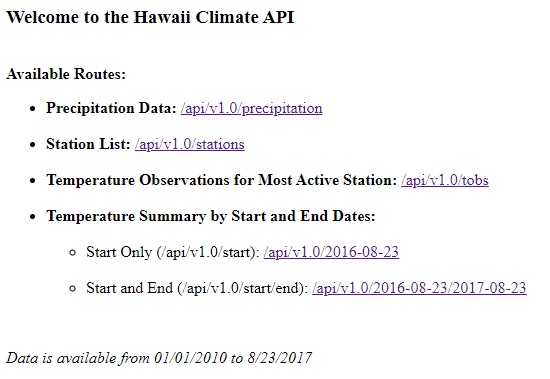
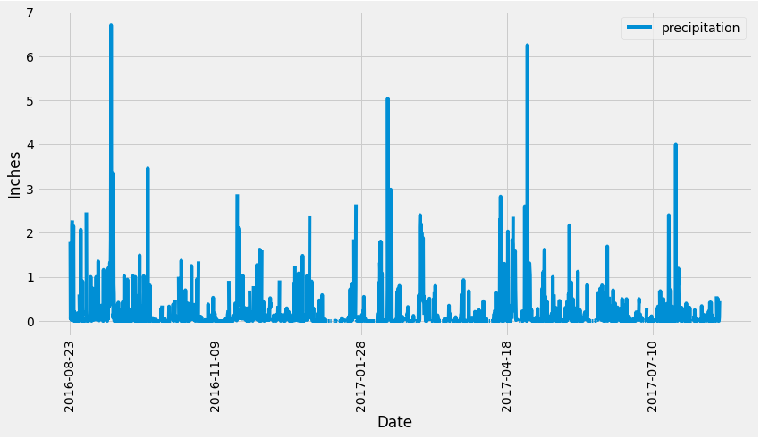
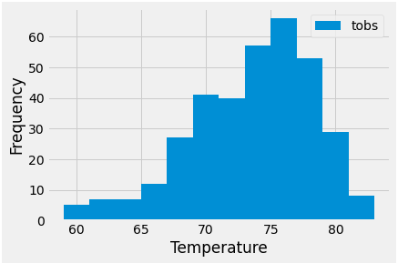

# Climate in Hawaii
This project is analysis on the climate in Hawaii in preparation for a trip to the state.

## Files in the Repo
* Climate Analysis Jupyter Notebook
* Flask App (app.py) that returns jsonified climate data through a variety of routes
* Images folder containing images of outputs

## Features
The repo features a flask app that allows users to navigate the data through the following routes:

* `/`

  * Home page.

  

* `/api/v1.0/precipitation`

  * Returns a JSON representation of a dictionary using `date` as the key and `prcp` as the value.

* `/api/v1.0/stations`

  * Returns a JSON list of stations from the dataset.

* `/api/v1.0/tobs`

  * Returns a JSON list of temperature observations (TOBS) of the most active station for the last year of data.

* `/api/v1.0/<start>` and `/api/v1.0/<start>/<end>`

  * Returns a JSON list of the minimum temperature, the average temperature, and the max temperature for a given start or start-end range.

  * When given the start only, calculates `TMIN`, `TAVG`, and `TMAX` for all dates greater than and equal to the start date.

  * When given the start and the end date, calculates the `TMIN`, `TAVG`, and `TMAX` for dates between the start and end date inclusive.

## Output
The Climate Analysis Jupyter Notebook:

* reviews the precipitation recorded by weather stations in the past year

    

* finds the most active station and reviews temperature observations for the past year

    

## Status
_finished_

## Inspiration
This project was assigned as part of the UTSA Data Analytics Bootcamp.
